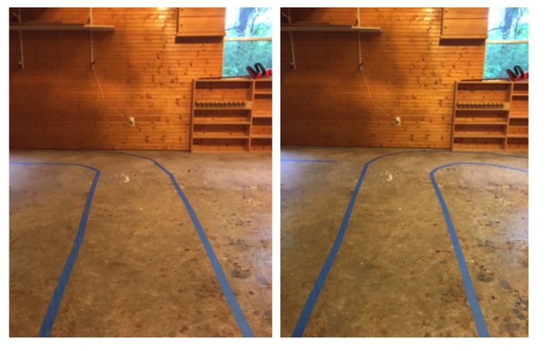
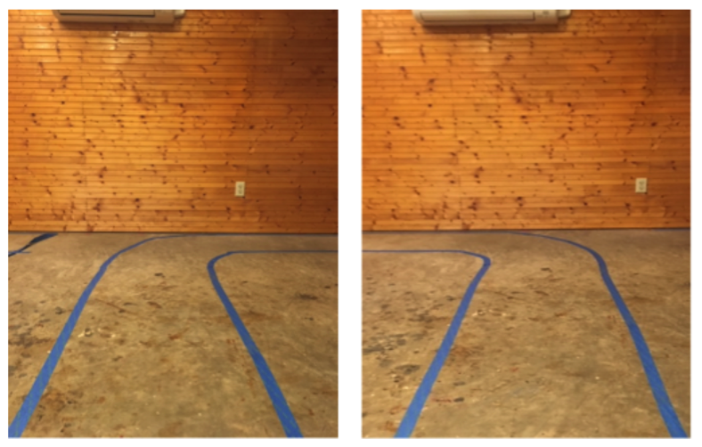

## Final Project: Training a Self-Driving RC Car

Howie Benefiel and Zach Southwell

For our final project, we decided to build and train an autonomous vehicle using the Donkey Car platform.

Donkey Car is a TensorFlow based, open source platform for autonomous RC car racing. It was initially developed by Will Roscoe and Adam Conway in late 2016[1] and currently has an active community of maintainers/users [2].

Here’s how it works:

· Build the car: The essential components are an off-the-shelf RC car, a Raspberry Pi, and a camera. Recommended parts, instructions and even starter kits are available on the Donkey[3] website.

· Install the software: You’ll need to install some software on the Pi and your computer.  These include TensorFlow libraries plus the Donkey Car application[4]

· Build a track: To train the car, you’ll want to construct a course. Laying down strips of tape to demarcate a lane (or multiple lanes) is the typical method. The idea is that the boundaries defined by the tape will hopefully be the primary visual queue used by the learning algorithm.

· Train your car: Next, you’ll need to collect a bunch of data to use for training. From the donkey car interface, you’ll start recording data as you drive the course. The Raspberry Pi will save images as well as labels recording the steering angle and throttle.  After you’ve collected at least ~5k images, you are ready to begin training your model.

· Build a model: This is the step where you’ll train a neural network on the training data that you’ve collected. Donkey Car software uses the Keras API to train a TensorFlow model.

· Test the model: Upload the model and see how it performs. You can even race it against others at autonomous car racing events! [4]

**The Build:** [Do you want to talk about the process of building the car?]

**Training the Autopilot:**

Tensorflow requires a lot of data in order to build a good model. For a simple track, you may be able to build a reasonable autopilot with a single training run of around 10 laps, but the model will be very fragile. Different lighting conditions will dramatically impact the autopilot performance and the model will not be able to generalize to other tracks. Also, if you let the autopilot attempt the same course in the reverse direction, it will likely not work at all.

A big consideration when collecting data is managing generalization error. The obvious example is if you collect all of your training data on a single course, there will likely be many visual cues along the course that will be picked up on by the neural network in addition to the lane markings. If you aren’t collecting a lot of data, then you may be inadvertently training the autopilot to turn left whenever it sees a tree or a chair.

We performed many training runs on different courses both inside and outside.  Here are some highlights:

Outdoor training runs: [add some info on the outdoor training?]

Indoor training runs were done in a lighted 320 square foot building with windows allowing a variable amount of additional light in. The autopilot performed fairly well after training on the first course at night:

The same autopilot did not do so well during daytime when lighting was different.  Additional training runs were done various daylight conditions, and also with several different course setups, including a couple of courses that were designed to present the autopilot nearly identical backdrops where the only visual cue would be the course markings:

The final training indoor course was relatively more complex, but after training with all the indoor courses, the autopilot performed well.

**Building a model:**

Models are trained with Tensorflow using the annotated images collected during training runs.  The autopilot training method included in the standard Donkeycar distribution[1] works fairly well, but we did find some other options available. One popular distribution[6] includes several additional methods for autopilot training, including a recurrent neural network (RNN) option that seemed to work very well.  RNNs have a temporal component, so the output of the model not only depends on the current image being evaluated, but also on the output of previous images.

**Test Performance:**

**Results:**

**References:**

[1] https://makezine.com/projects/build-autonomous-rc-car-raspberry-pi/

[2] https://donkeycar.slack.com

[3] donkeycar.com

[4] https://github.com/autorope/donkeycar

[5] https://diyrobocars.com

[6] https://github.com/tawnkramer/donkeycar
